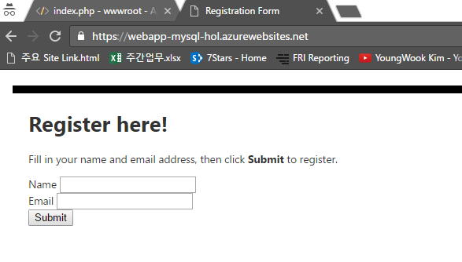

이름과 이메일 주소를 입력할 수 있는 간단한 Form을 만들어 보는 예제입니다.
wwwroot 폴더 아래에 index.php 라는 파일을 생성해주세요.
그리고 아래의 코드조각을 붙여넣으시기 바랍니다. 

~~~~
<html>
<head>
<Title>Registration Form</Title>

</head>
<body>
<h1>Register here!</h1>

Fill in your name and email address, then click <strong>Submit</strong> to register.

<form method="post" action="index.php" enctype="multipart/form-data" >
      Name  <input type="text" name="name" id="name"/> 
      Email <input type="text" name="email" id="email"/> 
      <input type="submit" name="submit" value="Submit" />
</form>

</body>
</html>
~~~~

웹 페이지 주소를 새로고침 해보시면 아래와 같이 폼 형식이 생성된 것을 확인하실 수 있습니다.

 
