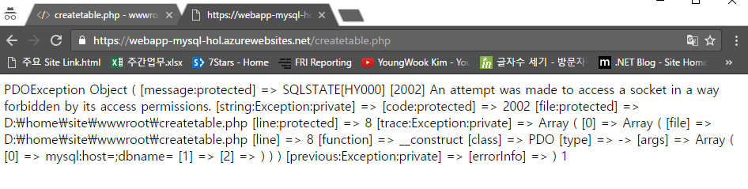

데이터베이스를 생성하는 예제입니다. 앞에서와 마찬가지로 wwwroot 폴더 아래에 createtable.php라는 파일을 생성하시기 바랍니다. 

그 다음 아래의 코드 조각을 삽입하시기 바랍니다. 

~~~~
<?php
// DB connection info
$host = "";
$user = "";
$pwd = "";
$db = "";
try{
    $conn = new PDO( "mysql:host=$host;dbname=$db", $user, $pwd);
    $conn->setAttribute( PDO::ATTR_ERRMODE, PDO::ERRMODE_EXCEPTION );
    $sql = "CREATE TABLE registration_tbl(
                id INT NOT NULL AUTO_INCREMENT, 
                PRIMARY KEY(id),
                name VARCHAR(30),
                email VARCHAR(30),
                date DATE)";
    $conn->query($sql);
}
catch(Exception $e){
    die(print_r($e));
}
echo "<h3>Table created.</h3>";
?>
~~~~

변경을 완료한 후에 (웹앱이름).azurewebsites.net/createtable.php 주소에 접속해 보면 아래와 같은 화면을 확인하실 수 있습니다. 

놀라지 마세요! 예상 했잖아요!! 다음 단계에서 Database 접속 정보를 알아낸 후 업데이트 하면 에러가 사라질 예정이니까요!  