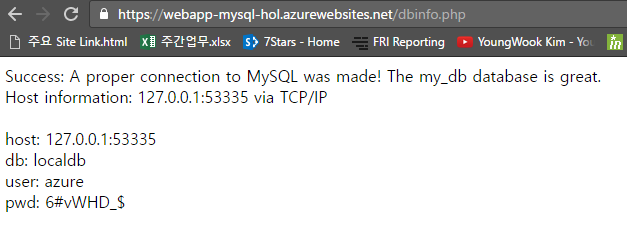
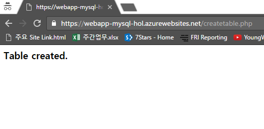

데이터베이스의 계정 정보를 알아내는 예제입니다. 앞에서와 마찬가지로 wwwroot 폴더 밑에 dbinfo.php라는 파일을 하나 생성해 주시기 바랍니다.

그 후에, 아래의 코드조각을 삽입해주시기 바랍니다. 

~~~~
<?php

$host = '';
$db = '';
$user = '';
$pwd = '';

foreach ($_SERVER as $key => $value) {
    if (strpos($key, "MYSQLCONNSTR_localdb") !== 0) {
        continue;
    }
    
    $host = preg_replace("/^.*Data Source=(.+?);.*$/", "\\1", $value);
    $db = preg_replace("/^.*Database=(.+?);.*$/", "\\1", $value);
    $user = preg_replace("/^.*User Id=(.+?);.*$/", "\\1", $value);
    $pwd = preg_replace("/^.*Password=(.+?)$/", "\\1", $value);
}

$link = mysqli_connect($host, $user, $pwd,$db);

if (!$link) {
    echo "Error: Unable to connect to MySQL." . PHP_EOL;
    echo "Debugging errno: " . mysqli_connect_errno() . PHP_EOL;
    echo "Debugging error: " . mysqli_connect_error() . PHP_EOL;
    exit;
}

echo "Success: A proper connection to MySQL was made! The my_db database is great." . PHP_EOL;
echo " \n";
echo "Host information: " . mysqli_get_host_info($link) . PHP_EOL;
echo " \n";
echo " \n";

echo "host: ";
echo $host;
echo " \n";
echo "db: ";
echo $db;
echo " \n";
echo "user: ";
echo $user;
echo " \n";
echo "pwd: ";
echo $pwd;

mysqli_close($link);

?>
~~~~

(웹앱이름).azurewebsites.net/dbinfo.php 주소에 접속해 보시면 여러분의 database 계정 상세정보를 확인하실 수 있습니다.

 

알아낸 정보를 이용하여 createtable.php 파일을 업데이트 해주시기 바랍니다.
아래와 같이 databse 관련 정보만 업데이트 하시면 됩니다. 

~~~~
$host = "127.0.0.1:포트번호";
$user = "아이디";
$pwd = "비밀번호";
$db = "데이터베이스 이름";
~~~~

(웹앱이름).azurewebsites.net/createtable.php 를 새로고침 하시면 아래와 같이 테이블이 생성 되었음을 알리는 메세지를 확인하실 수 있습니다.

 
