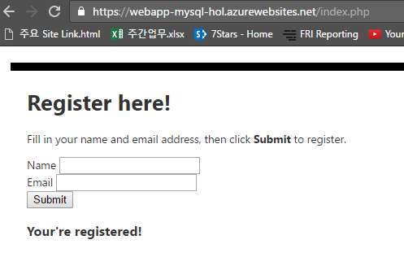

사용자가 아이디와 이메일 주소를 입력했을 때, 입력 정보를 Database에 삽입하는 구문을 추가할 예정입니다. 기존에 만들어 두신 index.php 파일을 다시 열어보시기 바랍니다. 

코드의 마지막 부분인 </form> 과 </body> 사이에 아래의 코드를 추가해 주시기 바랍니다.  

~~~~
<?php

//connecting to the database
// DB connection info
$host = "127.9.0.1:포트번호";
$user = "아이디";
$pwd = "패스워드";
$db = "local";
// Connect to database.
try {
    $conn = new PDO( "mysql:host=$host;dbname=$db", $user, $pwd);
    $conn->setAttribute( PDO::ATTR_ERRMODE, PDO::ERRMODE_EXCEPTION );
}
catch(Exception $e){
    die(var_dump($e));
}

//inserting registration information into the database
if(!empty($_POST)) {
try {
    $name = $_POST['name'];
    $email = $_POST['email'];
    $date = date("Y-m-d");
    // Insert data
    $sql_insert = "INSERT INTO registration_tbl (name, email, date) 
                   VALUES (?,?,?)";
    $stmt = $conn->prepare($sql_insert);
    $stmt->bindValue(1, $name);
    $stmt->bindValue(2, $email);
    $stmt->bindValue(3, $date);
    $stmt->execute();
}
catch(Exception $e) {
    die(var_dump($e));
}
echo "<h3>Your're registered!</h3>";
}
?>
~~~~

입력을 마치신 후에 (웹앱이름).azurewebsites.net 에 접속하시고, 데이터를 입력 해보시기 바랍니다. 
아래와 같이 You're registered! 라는 기분 좋은 멘트를 확인하실 수 있을 것 입니다. 

 
