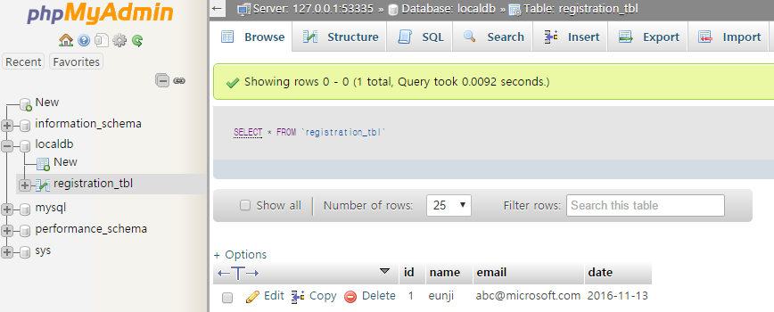
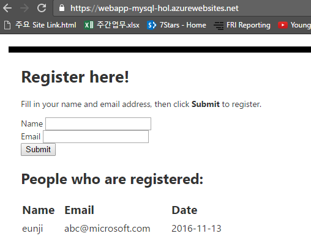

이제 마지막 입니다. 입력하신 데이터를 phpmyadmin 에서도 확인 하실 수 있지만, 좀 더 보기 수월하도록 웹 페이지 접속시에 보여주는 select 구문을 추가할 예정입니다.

참고로, phpmyadmin 페이지에 접속하시면 아래와 같이 입력하신 데이터를 확인하실 수 있습니다. 
 

index.php 파일을 다시 여시기 바랍니다. 
php 구문이 끝나기 직전 즉, ?> 앞 부분에 아래의 코드를 입력해 주시기 바랍니다. 

~~~~
//retrieving data from the database
$sql_select = "SELECT * FROM registration_tbl";
$stmt = $conn->query($sql_select);
$registrants = $stmt->fetchAll(); 
if(count($registrants) > 0) {
    echo "<h2>People who are registered:</h2>";
    echo "<table>";
    echo "<tr><th>Name</th>";
    echo "<th>Email</th>";
    echo "<th>Date</th></tr>";
    foreach($registrants as $registrant) {
        echo "<tr><td>".$registrant['name']."</td>";
        echo "<td>".$registrant['email']."</td>";
        echo "<td>".$registrant['date']."</td></tr>";
    }
    echo "</table>";
} else {
    echo "<h3>No one is currently registered.</h3>";
}
~~~~

입력을 마치셨으면 (웹앱이름).azurewebsites.net 주소에 다시 접속해 보시기 바랍니다. 
그러면 아래와 같이 여러분이 입력하신 데이터를 확인하실 수 있습니다. 

 

수고 많으셨습니다! :D

